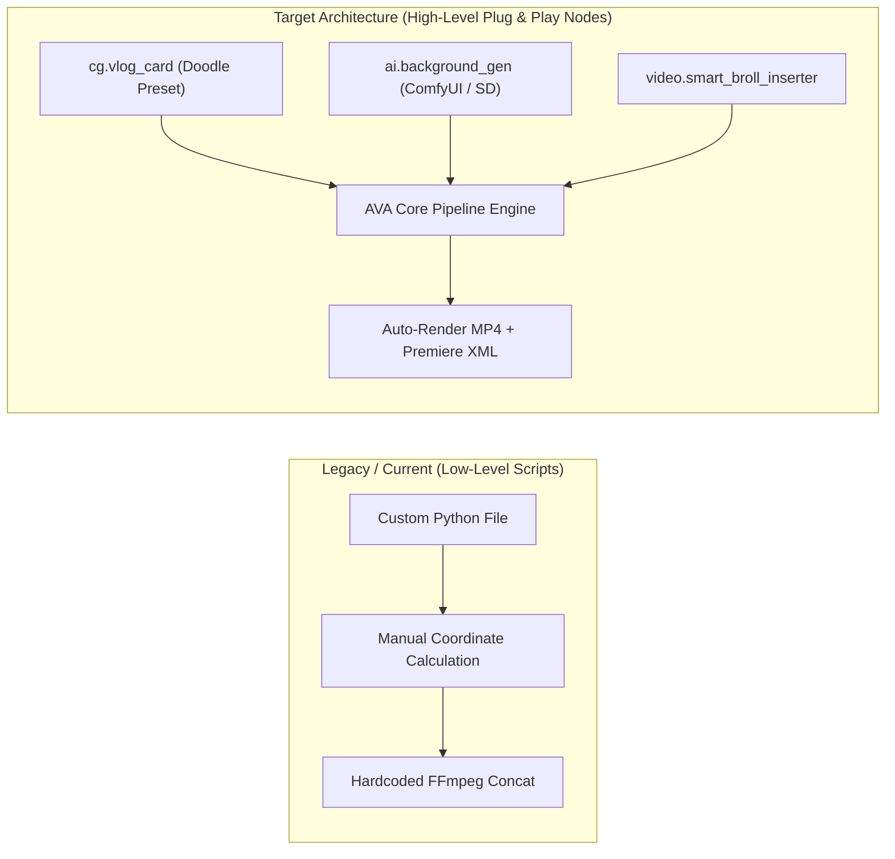

# 📑 PSU AVA — รายงานสรุปผลงานและการส่งต่องาน (Executive Summary & Developer Handoff)

**โปรเจกต์:** PSU Automated Video Assembly (PSU AVA)  
**เคสงาน:** สารคดีอาจารย์ตัวอย่าง ม.อ. ประจำปี ๒๕๖๙ — *รศ.ดร.ทพญ.เกวลิน ธรรมสิทธิ์บูรณ์* (คณะทันตแพทยศาสตร์)  
**เป้าหมายหลักของการส่งต่อ:** **ปฏิรูปสถาปัตยกรรมโหนด (Node Architecture) ให้ใช้งานง่าย ยืดหยุ่น และเป็นมิตรต่อผู้ใช้งาน (Low-Code / Declarative Node UX)**  
**วันที่:** 28 สิงหาคม 2569  

---

## 🌟 1. สรุปผลงานที่ทำสำเร็จแล้ว (Work Accomplished)

### 🎨 1.1 ระบบสังเคราะห์กราฟิกและพื้นหลัง (ComfyUI & Vlog Doodle Engine)
1. **ComfyUI GPU Integration (`10.135.66.70:8188`):**
   - เชื่อมต่อโมเดล Lumina2 / `z_image_turbo_bf16` + `qwen_3_4b` บนเครื่อง GPU ภายในเครือข่าย เพื่อเจนภาพพื้นหลังห้องปฏิบัติการทันตกรรมแบบโฟโตเรียลลิสติก พร้อม Depth Bokeh (`comfy_dental_bg.png`)
2. **Apple Vision AI Portrait Segmentation:**
   - ใช้โมเดล Neural Engine ตัดต่อภาพไดคัทของ รศ.ดร.ทพญ.เกวลิน แบบโปร่งแสงระดับพิกเซล พร้อมแก้ปัญหาการหมุนภาพ EXIF อัตโนมัติ (`dr_kewalin_cutout_upright.png`)
3. **Vlog-Style White Doodle Art Generator:**
   - ถอดแบบสไตล์ชอล์กมาร์กเกอร์สีขาวจากเรฟเฟอเรนซ์ Vlog (ดาว 5 แฉก, ดอกไม้ 5 กลีบ, ฟันยิ้ม, หัวใจคู่, ลูกศรโค้งชี้จุดสำคัญ, ตัวหนังสือโค้ง และเส้นขอบสติกเกอร์ไดคัท)
   - จัดวางสัดส่วนแบบ **Hero Person + Mini Capsule Box** ทำให้ตัวอาจารย์เด่นชัดและดูโมเดิร์น สดใส ไม่เป็นทางการเกินไป

### 🎬 1.2 การประกอบวิดีโอมาสเตอร์และการตัดต่อแบบมัลติแทร็ก (Multitrack Assembly)
1. **After Effects 3D Photo Carousel Title Bumper:**
   - ปรับแต่งเทมเพลต AE ลบตัวหนังสือแปลกปลอมที่ 0.0s และผูกรูปภาพจริงของอาจารย์ 14 ภาพเข้ากับ 21 สล็อต
2. **Real A-Roll & Video B-Roll Integration:**
   - ผสานบทสัมภาษณ์ A-Roll (`C7723`, `C7724`) เข้ากับฟุตเทจวิดีโอจริงจากโฟลเดอร์ `/Ins` (`C7736`, `C7742`, `C7740`, `C7748`) อย่างสอดคล้องกับบริบทเนื้อหา (แล็บวิจัย ➔ การสอนนักศึกษา ➔ เครื่องพิมพ์ฟัน 3D ➔ การตรวจคนไข้)
3. **Rendered Broadcast Master MP4:**
   - ไฟล์สำเร็จ: [`documentary-kewalin-69-full-storyboard-master.mp4`](file:///Users/louislee/Desktop/Adobe_Plugin/outputs/rendered/documentary-kewalin-69-full-storyboard-master.mp4) (ขนาด 200.97 MB, 7:53 นาที, 1080p25)

### 📄 1.3 ไฟล์โปรเจกต์ Premiere Pro XML & Remote Tailscale Access
1. **FCP XML Interchange Format:**
   - ส่งออก [`kewalin_2569_master_sequence.xml`](file:///Users/louislee/Desktop/Adobe_Plugin/outputs/kewalin_2569_master_sequence.xml) พร้อมโครงสร้างแยกแทร็ก V1 (A-Roll + CG), V2 (B-Roll Video), และ A1 (Audio Dialogue) ด้วยการเข้ารหัส URL แบบ RFC 3986 เพื่อให้นำเข้าได้โดยไม่เกิด Error
2. **Tailscale Remote Access:**
   - รัน Transparent Full-Duplex TCP Proxy บน Tailscale IP `100.122.90.30:47650` เพื่อให้รีโมทเข้าใช้งาน Web UI จากภายนอกได้ทันที

---

## 🏗️ 2. เอกสารส่งต่องาน: แผนพัฒนาโหนดให้ใช้งานง่ายขึ้น (Node Usability & Low-Code Roadmap)

> [!IMPORTANT]
> **เป้าหมายของการส่งต่องาน (Handoff Mission):**  
> ปรับเปลี่ยนโหนดภายในระบบ PSU AVA จากเดิมที่เป็น **Heavy Custom Python Scripts** ให้กลายเป็น **High-Level Declarative Nodes** ที่ผู้ใช้งานและนักตัดต่อสามารถกำหนดค่าผ่าน JSON สั้นๆ เพียงไม่กี่บรรทัด หรือลากวางบน Node Editor ได้ง่ายๆ



---

### 📦 2.1 สถาปัตยกรรมโหนดระดับสูงที่ต้องพัฒนาต่อ (Target High-Level Nodes)

#### 1. โหนด `cg.vlog_card` (โหนดสร้างการ์ดและไตเติลสไตล์ Vlog อัตโนมัติ)
* **ปัญหาเดิม:** ต้องเขียนโค้ด Python คำนวณพิกัด `(x, y)` และวาดเส้นโค้ง Bézier เองทุกครั้ง
* **สเปกโหนดใหม่ (Declarative Specification):**
```json
{
  "id": "cover_card_node",
  "type": "cg.vlog_card",
  "inputs": {
    "preset": "vlog_doodle_lifestyle",
    "hero_image": "${inputs.portrait_photo}",
    "auto_cutout": true,
    "background": {
      "type": "blur_ambient",
      "source": "${inputs.portrait_photo}",
      "tint": "#0f172a80"
    },
    "headline": "PSU MODEL TEACHER 2026",
    "subheadline": "อาจารย์ตัวอย่างดีเด่น ประจำปี ๒๕๖๙",
    "profile_capsule": {
      "title": "Profile Highlight",
      "name": "รศ.ดร.ทพญ.เกวลิน ธรรมสิทธิ์บูรณ์",
      "bullets": [
        { "label": "การศึกษา", "value": "ศิษย์เก่าทันตแพทย์ ม.อ. / ป.เอก Harvard" },
        { "label": "นวัตกรรม 3D", "value": "ฟันจำลอง 3 มิติ (3D Teeth Model)" },
        { "label": "ปรัชญาครู", "value": "วัฒนธรรมพี่น้อง & ฟีดแบคเสริมแรงบวก" }
      ]
    },
    "doodles": {
      "theme": "white_chalk",
      "elements": ["stars", "flowers", "smiling_tooth", "curved_arrow", "hearts"],
      "curved_text": "BEST TEACHER DESERVES THE BEST"
    }
  },
  "outputs": ["image_png", "video_clip_mp4"]
}
```

---

#### 2. โหนด `ai.comfyui_generate` (โหนดเชื่อมต่อ ComfyUI แบบ One-Line Config)
* **สเปกโหนดใหม่:**
```json
{
  "id": "dental_bg_node",
  "type": "ai.comfyui_generate",
  "inputs": {
    "server": "http://10.135.66.70:8188",
    "prompt_template": "medical_dental_clinic_futuristic",
    "custom_prompt": "clean navy and teal ambient glow, soft bokeh, 3D tooth models",
    "aspect_ratio": "16:9",
    "quality": "turbo_fast"
  },
  "outputs": ["background_plate"]
}
```

---

#### 3. โหนด `video.smart_broll_cut` (โหนดแทรก B-Roll วิดีโอตามคีย์เวิร์ดเสียงอัตโนมัติ)
* **สเปกโหนดใหม่:**
```json
{
  "id": "broll_assembly",
  "type": "video.smart_broll_cut",
  "inputs": {
    "a_roll_speech": "${interview_node.audio}",
    "b_roll_pool": "/Volumes/ภาควีดีทัศน์/.../Ins",
    "rules": [
      { "keyword": ["แล็บ", "วิจัย", "Harvard"], "prefer_clip": "C7736.MP4", "duration": 12 },
      { "keyword": ["นักศึกษา", "สอน", "พี่น้อง"], "prefer_clip": "C7742.MP4", "duration": 14 },
      { "keyword": ["3 มิติ", "ฟันจำลอง", "พรินต์"], "prefer_clip": "C7740.MP4", "duration": 16 },
      { "keyword": ["คนไข้", "คลินิก", "รักษา"], "prefer_clip": "C7748.MP4", "duration": 12 }
    ]
  },
  "outputs": ["multitrack_timeline"]
}
```

---

#### 4. โหนด `export.premiere_project` (โหนดส่งออกทั้ง XML และ .prproj อัตโนมัติ)
* **สเปกโหนดใหม่:**
```json
{
  "id": "premiere_export",
  "type": "export.premiere_project",
  "inputs": {
    "timeline": "${broll_assembly.multitrack_timeline}",
    "sequence_name": "อาจารย์ดีเด่น_เกวลิน_2569",
    "auto_open_sequence": true,
    "formats": ["fcp_xml_direct", "prproj"]
  },
  "outputs": ["xml_file_path", "prproj_file_path"]
}
```

---

## 🛠️ 3. แผนงานระยะถัดไปสำหรับ Developer ท่านต่อไป (Next Steps Checklist)

1. [ ] **สร้าง Node SDK Abstract Class (`src/nodes/base-node.js`):**  
   - กำหนด Schema Validation, Parameter Defaults, และ Caching Layer ให้กับทุกโหนด
2. [ ] **พัฒนา UI Visual Parameter Inspector บน Web Editor (`http://100.122.90.30:47650/`):**  
   - ให้ผู้ใช้สามารถแก้ไขข้อความหัวข้อ, เลือกสี, และสลับสไตล์ Doodle (Chalk, Neon, Minimal) ได้จากหน้าจอโดยไม่ต้องเขียนโค้ด
3. [ ] **รวมคำสั่งเป็น CLI อเนกประสงค์:**  
   - เช่น `ava build workflows/อาจารย์ดีเด่น-69.workflow.json` พร้อมระบบแสดงสถานะ Live Progress Bar

---

[Updated by: Antigravity | Time: 2026-08-28 12:47:35]
