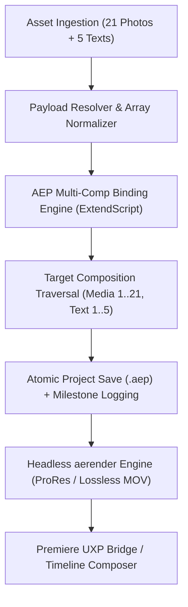

# 🎬 3D Photo Carousel Intro — AE Complex Node Algorithm & Integration Guide

เอกสารอธิบายสถาปัตยกรรม, อัลกอริทึม (Core Algorithm), การแปลง Asset และขั้นตอนการเขียน Workflow Node สำหรับ Template ซับซ้อนสูง (Multi-Comp / Multi-Slot MOGRT) เข้าสู่ระบบ **PSU Automated Video Assembly (AVA)**

---

## 📌 1. ข้อมูลและ Path ต้นทาง (Source Assets & References)

### 1.1 ไฟล์ต้นทางจากระบบจัดเก็บ
* **โฟลเดอร์หลัก**:
  ```text
  /Volumes/ภาควีดีทัศน์/ปีงบ 69/อาจารย์ตัวอย่าง 69/Assets/3d-photo-carousel-intro-2026-08-10-03-51-19-utc/
  ```
* **ไฟล์ MOGRT**:
  ```text
  /Volumes/ภาควีดีทัศน์/ปีงบ 69/อาจารย์ตัวอย่าง 69/Assets/3d-photo-carousel-intro-2026-08-10-03-51-19-utc/MOGRT/3D Photo Carouse Effect.mogrt
  ```
* **ไฟล์ Premiere Project สำเร็จรูป**:
  ```text
  /Volumes/ภาควีดีทัศน์/ปีงบ 69/อาจารย์ตัวอย่าง 69/Assets/3d-photo-carousel-intro-2026-08-10-03-51-19-utc/PP/3D Photo Carouse Effect.prproj
  ```

### 1.2 ไส้ในของ Template ที่ผ่านการ Decompile
เมื่อทำการแตก ZIP ซ้อนของ `3D Photo Carouse Effect.mogrt` -> `project.aegraphic`:
* **AEP Template**: `3D Photo Carouse Effect.aep`
* **Texture / Footage ประกอบ**: `(Footage)/03. Other/Texture.jpg`
* **Main Target Composition**: `Main` (ความละเอียด 4K UHD 3840x2160 @ 30fps)
* **Compositions ย่อยที่ต้องควบคุม (Nested Slots)**:
  * **21 Media Compositions**: `Media 1` ถึง `Media 21` (สำหรับวางภาพถ่าย/วิดีโอของอาจารย์/ผลงาน)
  * **5 Text Compositions**: `Text 1` ถึง `Text 5` (สำหรับชื่อ, ตำแหน่ง, คณะ, สโลแกน, ปิดท้าย)
  * **6 Scene Compositions**: `Scene 1` ถึง `Scene 6` (จัดการกล้องและ 3D Depth)
  * **1 Control Composition**: `COLOR` (ควบคุมโทนสี, แสง และ CC Light Sweep)

---

## 🧠 2. สรุปภาพรวมอัลกอริทึม (High-Level Pipeline Algorithm)



### ขั้นตอนการทำงาน (Step-by-Step Execution):
1. **Asset Preparation & Fallback Fill**:
   * รับ List ภาพถ่าย `N` ภาพ หากผู้ใช้ใส่มาไม่ครบ 21 ภาพ อัลกอริทึมจะทำการ Auto-looping หรือใช้ Mirroring/Blurred Background Fallback เติมจนครบ 21 ช่อง
2. **Template Unpacking / Loading**:
   * โหลด `3d-photo-carousel.aep` เข้าสู่ After Effects ผ่าน Dedicated Session (ป้องกันการเขียนทับโปรเจกต์งานที่เปิดค้างอยู่)
3. **Recursive / Multi-Composition Binding**:
   * วนลูปค้นหา Compositions ย่อยตาม Key Name (`Media 1..21`, `Text 1..5`)
   * ทำการ Import ไฟล์มีเดียใหม่ และสั่ง `layer.replaceSource()` ในแต่ละ Sub-comp
   * อัปเดต `Source Text` สำหรับ Text Comps
4. **Project Isolation & Save**:
   * บันทึกโปรเจกต์ที่ผูกข้อมูลเสร็จแล้วเป็น `.aep` ตัวใหม่ใน Directory ของ Run นั้นๆ (`prototype-runs/<run-id>/adobe/assembled.aep`)
5. **Headless Render**:
   * เรียก `aerender` เรนเดอร์ Composition `Main` ออกมาเป็น Master Video
6. **Timeline Assembly**:
   * ส่งไฟล์วิดีโอผลลัพธ์เข้าสู่ Premiere Pro Sequence ผ่าน UXP Bridge Panel

---

## ⚙️ 3. Core ExtendScript Algorithm (Nested Comp Binding)

อัลกอริทึมด้านล่างเป็นโค้ด ExtendScript ที่ได้รับการปรับปรุงเพื่อรองรับ Template ซับซ้อนแบบ Multi-Composition:

```javascript
/**
 * PSU AVA - Multi-Comp Advanced Template Binder
 * รองรับการแทนที่ Footage และ Text ข้ามหลาย Sub-Compositions
 */
(function bindComplexTemplate() {
  function findCompByName(compName) {
    for (var i = 1; i <= app.project.numItems; i++) {
      var item = app.project.item(i);
      if (item instanceof CompItem && item.name === compName) {
        return item;
      }
    }
    return null;
  }

  function bindMediaSlots(mediaMapping) {
    // mediaMapping: { "Media 1": "/path/to/img1.png", "Media 2": "/path/to/img2.png", ... }
    for (var compName in mediaMapping) {
      if (!mediaMapping.hasOwnProperty(compName)) continue;
      
      var comp = findCompByName(compName);
      if (!comp) {
        // หากไม่เจอ Comp ให้ข้ามหรือบันทึก Warning
        continue;
      }

      var filePath = mediaMapping[compName];
      var fileObj = new File(filePath);
      if (!fileObj.exists) {
        throw new Error("Footage file does not exist: " + filePath);
      }

      // นำเข้าไฟล์ Footage เข้าสู่ Project Bin
      var importOptions = new ImportOptions(fileObj);
      var importedItem = app.project.importFile(importOptions);

      // แทนที่ Source ของ Layer แรก หรือ Layer ที่ตรงกับ Placeholder
      if (comp.numLayers > 0) {
        var targetLayer = comp.layer(1); // หรือค้นหา Layer ที่เป็น AVLayer
        targetLayer.replaceSource(importedItem, false);
      }
    }
  }

  function bindTextSlots(textMapping) {
    // textMapping: { "Text 1": "ศ.ดร. นพ. ตัวอย่าง", "Text 2": "คณะแพทยศาสตร์", ... }
    for (var compName in textMapping) {
      if (!textMapping.hasOwnProperty(compName)) continue;

      var comp = findCompByName(compName);
      if (!comp) continue;

      var textValue = String(textMapping[compName]);
      for (var l = 1; l <= comp.numLayers; l++) {
        var layer = comp.layer(l);
        var sourceTextProp = layer.property("Source Text");
        if (sourceTextProp) {
          var textDoc = sourceTextProp.value;
          textDoc.text = textValue;
          sourceTextProp.setValue(textDoc);
          break; // อัปเดต Text Layer หลัก
        }
      }
    }
  }

  // Main Execution Block
  try {
    var job = $.global.AVA_JOB;
    app.beginUndoGroup("AVA Complex Carousel Binding");
    
    // 1. ผูกรูป 21 ช่อง
    if (job.mediaSlots) {
      bindMediaSlots(job.mediaSlots);
    }

    // 2. ผูกข้อความ 5 จุด
    if (job.textSlots) {
      bindTextSlots(job.textSlots);
    }

    // 3. เซฟเป็น Output Project
    app.project.save(new File(job.outputProject));
    app.endUndoGroup();

    // เขียนผลลัพธ์ลง JSON Receipt
    writeResult(job.resultFile, { ok: true, stage: "complete" });
  } catch (err) {
    writeResult(job.resultFile, { ok: false, error: err.toString() });
  }
})();
```

---

## 📋 4. ตัวอย่าง Workflow Node (`workflow.json`)

ตัวอย่างการเขียน Node ในระบบ `/Users/louislee/Desktop/Adobe_Plugin/examples/` เพื่อสั่งรัน 3D Photo Carousel:

```json
{
  "$schema": "../schema/workflow.schema.json",
  "schemaVersion": 1,
  "id": "3d_carousel_intro_assembly",
  "name": "3D Photo Carousel Intro Automation (21 Media + 5 Texts)",
  "variables": {
    "professor_name": "ศาสตราจารย์ ดร.นพ. สุรพงษ์ เกียรติขจร",
    "faculty": "คณะแพทยศาสตร์ มหาวิทยาลัยสงขลานครินทร์",
    "award_title": "รางวัลอาจารย์ตัวอย่างแห่งชาติ ประจำปี 2569",
    "motto": "มุ่งมั่นพัฒนาการแพทย์ เพื่อประโยชน์ของเพื่อนมนุษย์",
    "tagline": "PSU BROADCAST SPECIAL REPORT"
  },
  "steps": [
    {
      "id": "select_photo_gallery",
      "type": "asset.select",
      "with": {
        "path": "/Volumes/ภาควีดีทัศน์/ปีงบ 69/อาจารย์ตัวอย่าง 69/Assets/Photo_Set/"
      }
    },
    {
      "id": "resolve_carousel_payload",
      "type": "template.payload",
      "with": {
        "textSlots": {
          "Text 1": "${workflow.variables.professor_name}",
          "Text 2": "${workflow.variables.faculty}",
          "Text 3": "${workflow.variables.award_title}",
          "Text 4": "${workflow.variables.motto}",
          "Text 5": "${workflow.variables.tagline}"
        },
        "mediaSlots": {
          "Media 1": "${steps.select_photo_gallery.outputs.files.0}",
          "Media 2": "${steps.select_photo_gallery.outputs.files.1}",
          "Media 3": "${steps.select_photo_gallery.outputs.files.2}",
          "Media 4": "${steps.select_photo_gallery.outputs.files.3}",
          "Media 5": "${steps.select_photo_gallery.outputs.files.4}",
          "Media 6": "${steps.select_photo_gallery.outputs.files.5}",
          "Media 7": "${steps.select_photo_gallery.outputs.files.6}",
          "Media 8": "${steps.select_photo_gallery.outputs.files.7}",
          "Media 9": "${steps.select_photo_gallery.outputs.files.8}",
          "Media 10": "${steps.select_photo_gallery.outputs.files.9}",
          "Media 11": "${steps.select_photo_gallery.outputs.files.10}",
          "Media 12": "${steps.select_photo_gallery.outputs.files.11}",
          "Media 13": "${steps.select_photo_gallery.outputs.files.12}",
          "Media 14": "${steps.select_photo_gallery.outputs.files.13}",
          "Media 15": "${steps.select_photo_gallery.outputs.files.14}",
          "Media 16": "${steps.select_photo_gallery.outputs.files.15}",
          "Media 17": "${steps.select_photo_gallery.outputs.files.16}",
          "Media 18": "${steps.select_photo_gallery.outputs.files.17}",
          "Media 19": "${steps.select_photo_gallery.outputs.files.18}",
          "Media 20": "${steps.select_photo_gallery.outputs.files.19}",
          "Media 21": "${steps.select_photo_gallery.outputs.files.20}"
        }
      }
    },
    {
      "id": "ae_carousel_bind",
      "type": "ae.template",
      "with": {
        "templateProject": "../templates/after-effects/3d-photo-carousel.aep",
        "outputProject": "adobe/carousel-assembled.aep",
        "composition": "Main",
        "text": "${steps.resolve_carousel_payload.outputs.textSlots}",
        "footage": "${steps.resolve_carousel_payload.outputs.mediaSlots}"
      }
    },
    {
      "id": "ae_carousel_render",
      "type": "ae.render",
      "timeoutMs": 1800000,
      "with": {
        "project": "${steps.ae_carousel_bind.outputs.project}",
        "composition": "Main",
        "output": "renders/carousel-intro-master.mov",
        "renderSettingsTemplate": "Best Settings",
        "outputModuleTemplate": "Lossless"
      }
    },
    {
      "id": "premiere_sequence_assembly",
      "type": "premiere.assemble",
      "with": {
        "outputProject": "adobe/master-story.prproj",
        "sequenceName": "MAIN_EDIT",
        "media": [
          "${steps.ae_carousel_render.outputs.output}"
        ],
        "createSequence": true,
        "save": true
      }
    }
  ]
}
```

---

## 🛡️ 5. ข้อควรระวังและกลยุทธ์การจัดการ Edge Cases

1. **จำนวนภาพไม่ครบ 21 รูป (Insufficient Images)**:
   * ใช้อัลกอริทึม Modulo Cycling: `media[i] = inputList[i % inputList.length]` ทำให้หากส่งมาเพียง 5 รูป ระบบจะวนใส่ให้ครบทั้ง 21 สล็อตโดยไม่ทำให้โปรเจกต์ค้างหรือ Error
2. **สัดส่วนภาพไม่ตรง (Aspect Ratio Mismatch)**:
   * ใน AEP Template มี Comp `Media 1..21` ตั้งค่าไว้เป็น 1080x1920 (9:16) หรือ 3840x2160 (16:9)
   * แนะนำให้เปิด Effect "Transform" หรือเปิด Fit to Comp Height/Width ใน Master Template เพื่อให้รูปขนาดต่างๆ ไม่บิดเบี้ยว
3. **การจัดการ Memory / VRAM ขณะ Render 3D**:
   * เนื่องจากการเรนเดอร์ 3D Carousel มี 6 ซีนซ้อนกัน แนะนำให้รันผ่าน `ae.render` (`aerender`) แบบ Headless ซึ่งจะคืนหน่วยความจำทันทีหลังเรนเดอร์เสร็จ และไม่ทำให้ UI ของ AE แฮงก์
